# Bundles & Packages — Frontend Design Output

> **Design round deliverable** feeding the engineering spec. Visual proposals for the Packages feature, grounded in the **live** Aasan V2 design system as read from the codebase (`src/styles/tokens.css`, `typography.css`, `dashboard.css`, and the `ui/*` primitives).
>
> **⚠ Design-system reconciliation (read first).** The brief's §1 describes copper `#b0561f`, Instrument Serif, Inter, surface `#fafaf9`. The **shipped code does not match that** — it uses **Navy `#1c104c`** as `accent-default` (light), a **Gold `#c9a96e`** secondary, **Cormorant Garamond** (display) + **DM Sans** (body), warm-cream surface `#f8f5f0`, with an editorial big-numeral treatment in the V2 dashboard. **Every mockup here is built against the live tokens, not the brief's stale palette.** If the brief reflects an intended re-skin, flag it back — see open-questions file.
>
> Interactive source: the full set of artboards is also available as a pannable HTML canvas (`packages-design/Packages Design Exploration.html`) plus a per-screen render harness (`packages-design/render.html`) if you want to re-capture at other sizes/themes.

---

## System decisions that cut across every screen

A small visual grammar was established up front so the new concept reads consistently:

| Signal | Token | Meaning |
|---|---|---|
| **Navy** | `accent-default` (`#1c104c` light / remaps to gold `#c9a96e` on dark) | "What's being paid **now**" — primary actions, package **sale** lines, focus rings |
| **Gold** | `gold-default` `#c9a96e` | "What the customer **already owns**" — packages, entitlements, redemption lines, credits |
| **Success green** | `success-*` | Reserved for existing "booked/confirmed" semantics — not reused for packages |
| **Amber/warning** | `warning-*` | Expiry urgency + "confirm with customer" moments |
| **Danger red** | `danger-*` | Refund / pending-balance / cancellation-fee figures |

**Non-negotiables honored throughout:** tabular numerals on every money/count/time (`.tabular`); touch targets ≥44px on POS surfaces; redemption lines render at **full strength** (real services, just paid earlier) distinguished by a gold left-rail + gift glyph, never dimmed; PII redaction for Staff role is visually explicit; both themes shown for every major surface; all motion ≤180ms with `prefers-reduced-motion` zeroing.

**One proposed primitive addition** (rather than per-page one-offs): a `SessionsLeft` numeral (counted `7/10` or ∞) + `ExpiryBadge` (green/amber/red by days-left) pair, reused across the POS rail, customer profile, and refund modal.

---

## Q-VIS-9 · POS page-level IA

**Intent:** Make packages a first-class transactional primitive on the POS without disturbing the receptionist's `select customer → add items → take payment` muscle memory. The core question: how do "entitlements the customer already owns" coexist with "what they're paying for today"?

Both directions keep the existing flow and the service/products/**packages** selector; they differ in *where the customer's existing entitlements live*.

### Direction A — Entitlements Rail  ★ Recommended

A permanent rail sits **between** the service selector and the bill canvas, headed "Already paid for". It lists the customer's active packages (as `SessionsLeft` + `ExpiryBadge` cards) plus store credit. **It does not exist until a customer is selected** — the idle screen is byte-for-byte the current POS.

- **Intent:** Give "what they own" a permanent, glanceable home that's a visual peer to "what they're buying," so the cashier sees redeemable entitlements *before* adding a service.
- **Mockups:**
  - State 3 (has packages, empty bill): 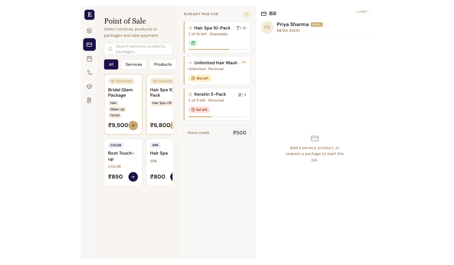 · dark: 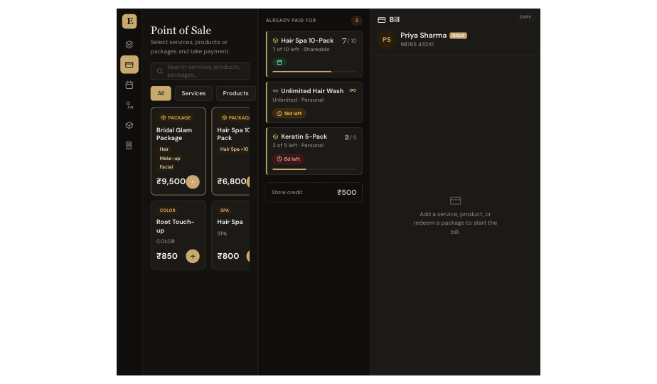
  - State 4 (mid-bill, mixed paid + redeemed): 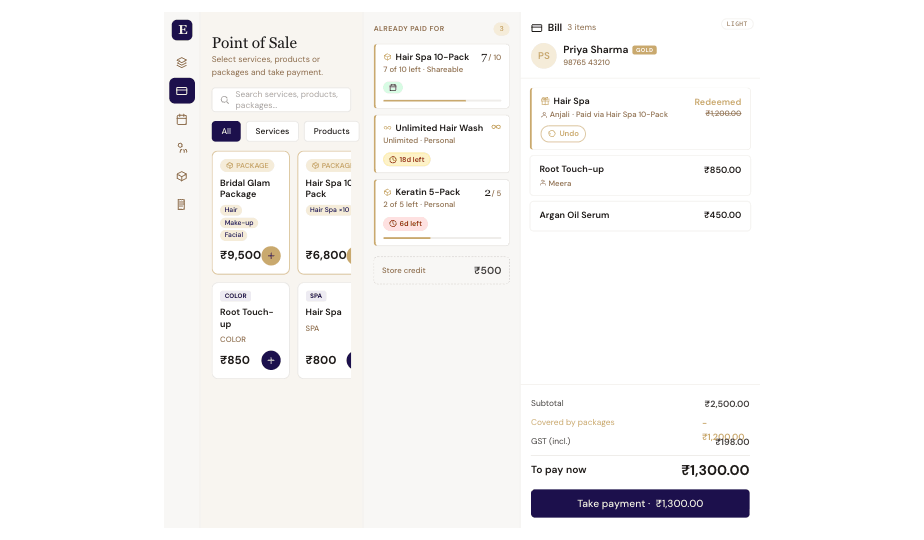 · dark: 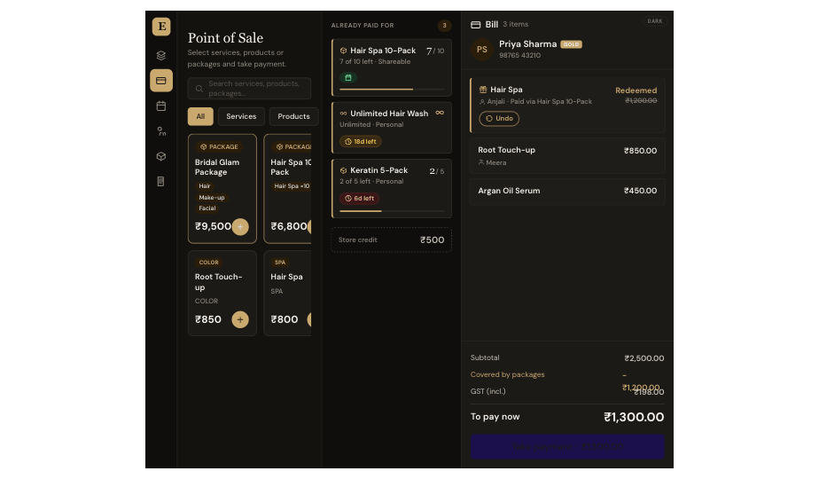
  - State 1 (idle, no customer — rail absent): 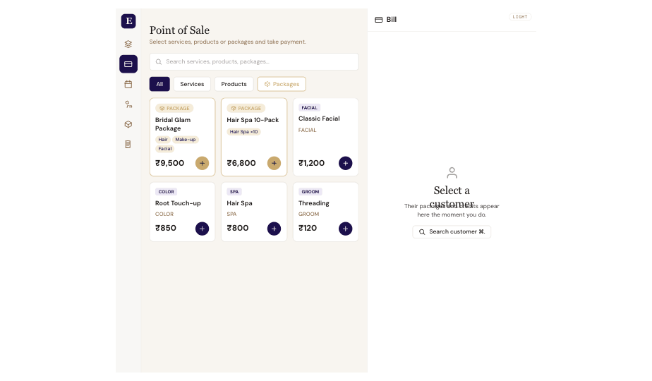
  - State 2 (customer, no packages — rail absent, bill shows customer header): 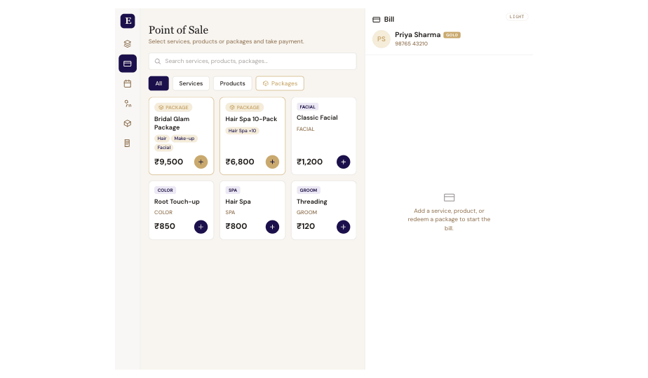
- **Trade-offs:** Costs ~240px of horizontal width that, on a 10" tablet in portrait-ish landscape, competes with the service grid (the grid drops from 4→3 columns). Gains a durable, scannable surface that makes the "active packages" badge concept redundant (the rail *is* the badge, permanently) and unifies "owns / owed / credit" in one place.
- **Token usage:** rail bg `surface-sidebar`; each entitlement card `surface-card` + `border-default` with a 3px `gold-default` left rail; `SessionsLeft` numeral uses the `db-num` editorial recipe in `text-primary`; expiry pills are `success/warning/danger` soft tokens; store-credit chip is a dashed `border-strong`. Bill canvas unchanged (`surface-card`, `border-subtle`).

### Direction B — Identity + Entitlements Strip

Identity + entitlements collapse into a **high-density horizontal strip** across the top of the selector column, freeing the full column height for a wider bill canvas.

- **Intent:** Preserve maximum grid/bill width by carrying entitlements horizontally as compact chips rather than a vertical rail.
- **Mockups:**
  - State 3 (has packages): 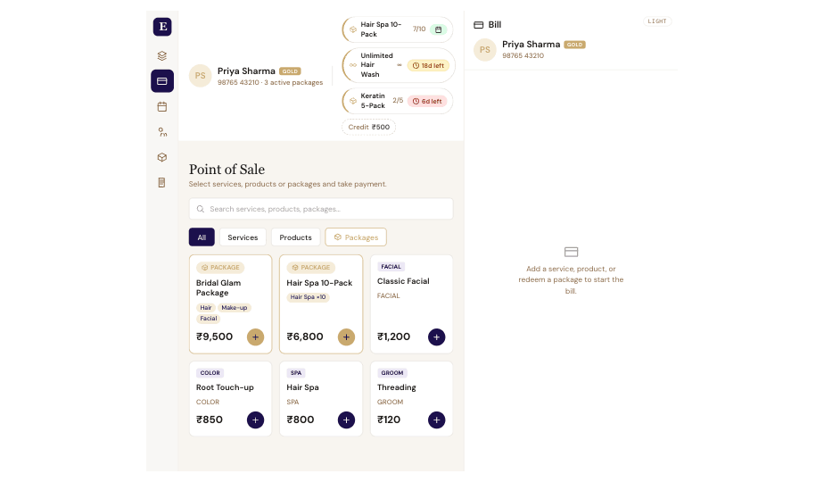
  - State 4 (mid-bill): 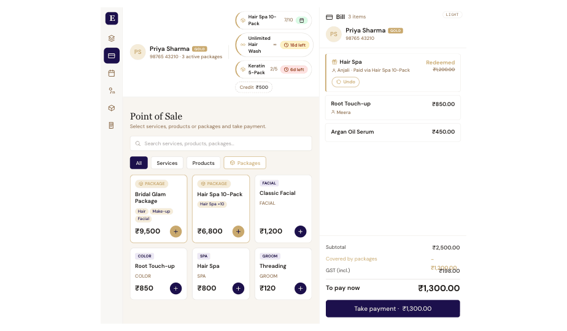
  - (Idle / no-package states share the rail direction's selector + bill; strip simply absent.)
- **Trade-offs:** Wins vertical real estate and a wider grid; but each package compresses to a single chip (`name · 7/10 · expiry`), so detail (shareable? progress bar?) is lost without a hover/expand, and 4+ packages force a "+N" overflow that hides entitlements behind an interaction — exactly when the cashier most needs to see them.
- **Token usage:** strip bg `surface-card` + `border-subtle` bottom; each chip `surface-row` with 3px `gold-default` left rail; `ExpiryBadge` inline; customer name uses `text-primary` with the tier slot beside it.

### Recommendation: **Direction A — Entitlements Rail**

It best fits the density-first V2 language and the receptionist context. The rail makes entitlements *persistently legible* (no hover, no overflow-hiding) which matters most on a touch tablet where the cashier's hands are busy and a customer is waiting. It also **consolidates** three previously-separate ideas — the "active packages badge," store credit, and pending — into one durable surface, so we ship *fewer* floating banners, not more. The width cost is real but acceptable: the service grid stays usable at 3 columns, and the rail only appears when a customer (and therefore the need) exists. Direction B's horizontal compression trades away exactly the glanceability that justifies the feature.

> **Framing knock-on:** because the rail is the permanent home for entitlements, the standalone "active packages badge" (Q-VIS-3) becomes a **fallback** for any POS layout that *doesn't* adopt the rail (or for narrow viewports where the rail collapses), not a primary surface. Both are specced below.

---

## Q-VIS-1 · Build Your Own Package form (Owner desktop)

**Intent:** Make a genuinely complex flow — add services → see running MRP → apply a package discount → fine-tune per line → publish — feel obvious on a desktop, scaling from a 3-service bundle to a 15-service pack.

- **Mockups:**
  - Counted / bundle (4 services, 1 line locked): 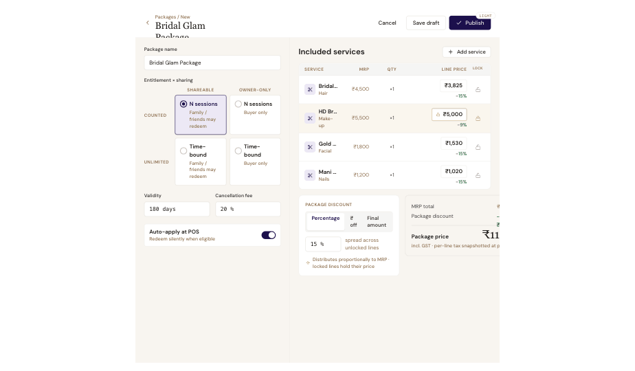 · dark: 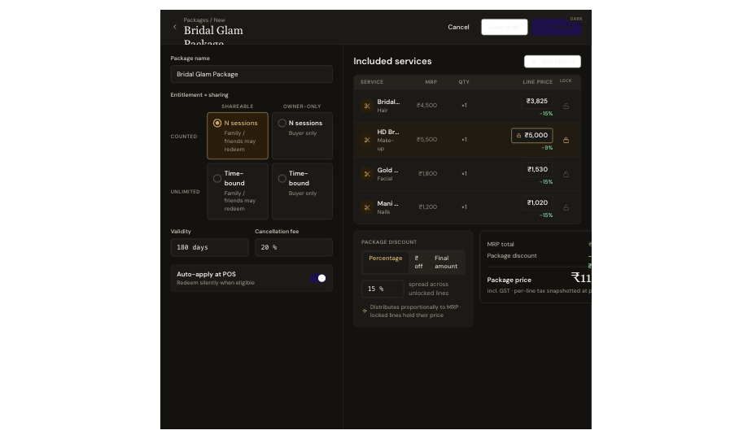
  - Unlimited (Qty column collapses): 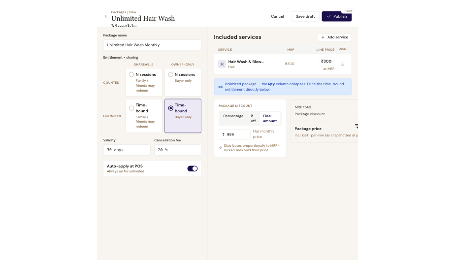

**Layout:** two columns. **Left** = package-level config (name, entitlement × sharing matrix, validity, cancellation fee, auto-apply toggle) on a `surface-page` panel. **Right** = the services table + discount control + live price summary on `surface-card`. Config is "what kind of package," pricing is "what's in it and what it costs" — the split keeps the busy table from competing with the toggles.

### Sub-decisions

**Discount toggle (`%` / `₹ off` / Final amount) — 3 variants considered:**
- **A · Segmented control ★** — one control, three labels; the input's suffix morphs (`%` / `₹`). Native to the V2 primitive set, lowest ambiguity.
- **B · Switcher tabs** — reads too heavy; tabs imply a page region, stealing weight from the table.
- **C · Inline label morph** — most compact but hides the mode inside a dropdown, a discoverability cost for a per-package decision.
- **Recommendation: A.** Shown in the form mockups as the segmented `Percentage / ₹ off / Final amount` control.

**Locked vs unlocked lines:** a line the admin price-overrides becomes **locked** — signaled with (a) a small `gold-default` lock glyph in the price cell, (b) a faint `gold-soft` row tint, and (c) a lock/unlock toggle in the rightmost column. Quiet, not alarming. Locked lines hold their price; further package-level discount changes redistribute only across **unlocked** lines, proportionally to MRP.

**MRP-vs-final diff:** lives **always-visible** as small text under each line price (`−15%` in `success-fg`, or "at MRP" muted) — not hover-gated, because the whole point of the screen is seeing the discount land per line.

**Redistribution preview:** unlocked line prices **tween over ~120ms** to their new values when the package discount changes (snaps instantly under `prefers-reduced-motion`); locked lines don't move. A momentary `+/−` delta chip can fade beside changed lines (optional, low priority).

**Entitlement × Shareability matrix:** presented as a **2×2 visual selector** (rows: Counted / Unlimited; columns: Shareable / Owner-only), each cell a radio card with a one-line description. Beats two stacked radio groups because the *combination* is the decision, and the grid makes all four legal combinations visible at once.

**Unlimited reshape:** when the Unlimited row is selected, the table's **Qty column collapses** (a `total_sessions` count is meaningless), an info strip explains the reshape, and the discount control defaults to **Final amount** (you price a time-bound entitlement directly, not a per-session discount). See the unlimited mockup.

**Scale to 15 services:** the table is a real data table with sticky `surface-row-hover` header, 28px service glyph, ellipsized names, and tabular price columns — density-first, stays readable by adding rows, not cards.

- **Token usage:** table header `surface-row-hover` + `t-overline`; locked row tint `gold-soft` @ 45%; lock glyph `gold-default`; line discount `success-fg`; segmented active state `surface-card` + `accent-default` text + `shadow-xs`; matrix selected cell `accent-bg-soft` + 1.5px `accent-default`; summary "Package price" uses `db-num` editorial numeral; Publish is `accent-default` primary.
- **States:** populated (shown); empty = "Add your first service" row prompt; the live summary is the loading/feedback surface as lines redistribute.

---

## Screen 1 · Package catalog (`/dashboard/packages`)

**Intent:** Let the owner see and manage all package definitions at a glance — density-first list, status at a glance, sold-count as the signal of what's working.

- **Mockups:** populated 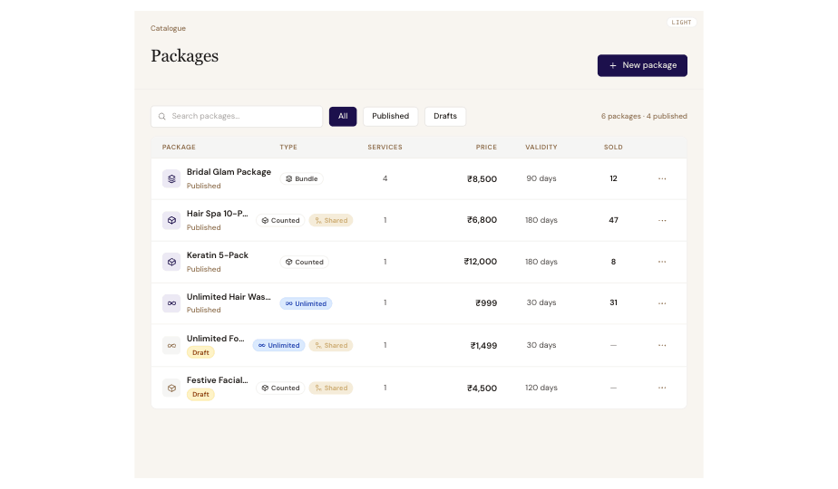 · dark 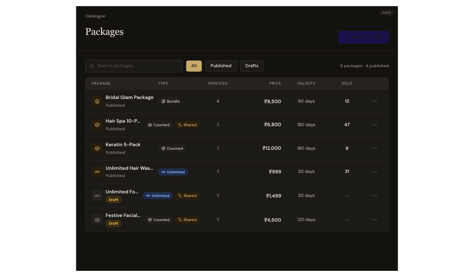 · **first-run empty** 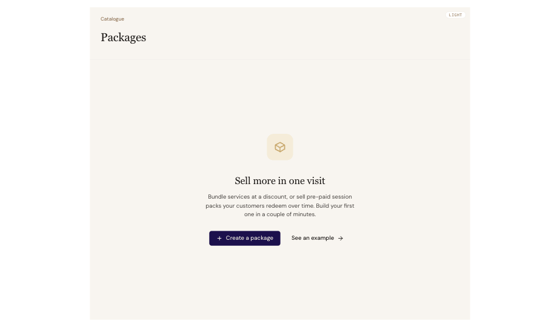
- **Detail:** columns = Package (glyph + name + published/draft) · Type (`Bundle`/`Counted`/`Unlimited` badge + `Shared` gold badge) · Services count · Price · Validity · Sold · overflow kebab. Filter chips `All / Published / Drafts`. Drafts get a `warning` badge and a muted glyph.
- **States:** populated, **empty** (serif headline "Sell more in one visit" + create CTA, per the soft-constraint to reserve serif for empty-state headlines), drafts (role-restricted: create/edit is Owner-only; Receptionist sees the list read-only).
- **Token usage:** table identical pattern to existing list surfaces — `surface-card` body, `surface-row-hover` header, `border-subtle` row dividers; type glyph chip `accent-bg-soft`; Unlimited type badge uses `info` tone to separate it from counted.

---

## Q-VIS-2 · Selling a package at POS

**Intent:** Let the receptionist add a package to a bill and convey "this is a multi-line product" without bloat.

- **Mockup:** 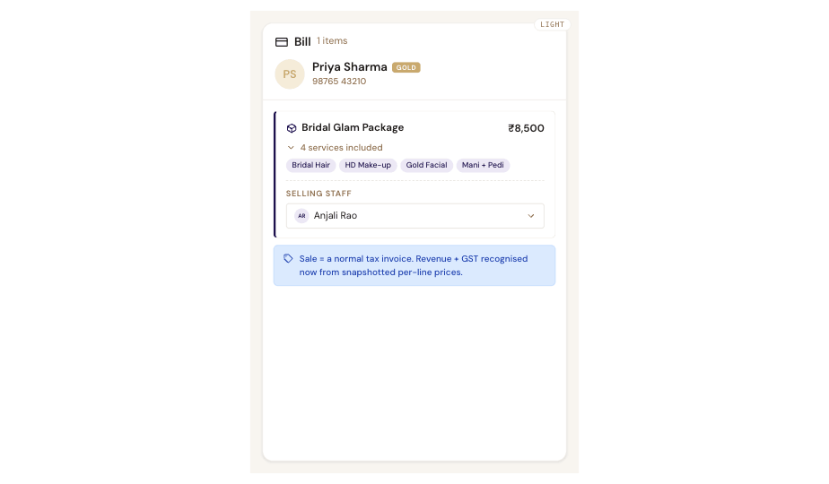 · dark 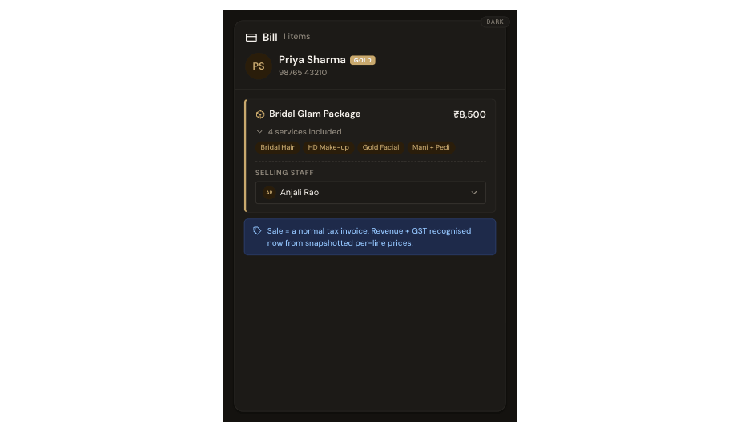
- **Package list view in the selector:** package rows are **cards with an inner service-chip cluster** (e.g. `Hair · Make-up · Facial`), bordered in `gold-default` and flagged with a `PACKAGE` badge, so multi-line-ness reads instantly versus a flat service row. (Visible in the Q-VIS-9 rail mockups' selector.)
- **Bill line summary:** the `package_sale_line` shows the package name + an **accordion** "4 services included" that expands to an inline chip cluster — collapsed by default to protect bill density, expandable for confirmation. Chosen over an always-open list (bloat) and a "view details" modal (interruption).
- **Selling-staff picker:** **inline on the line** (a compact avatar + name select under a dashed divider), not a popover or sidebar — it's a per-line attribute and belongs on the line, reachable in one tap.
- **Token usage:** sale line gets a 3px `accent-default` left rail (navy = paid-now revenue event); included-service chips `accent-bg-soft`; staff select `border-default` on `surface-card`. Info strip notes revenue + GST recognized now from snapshotted per-line prices.

---

## Q-VIS-3 · Redemption at POS

**Intent:** The most-used flow in the feature — must be fast, unambiguous, and rarely interrupt with a modal.

### Single eligible package — silent auto-apply

- **Mockup:** 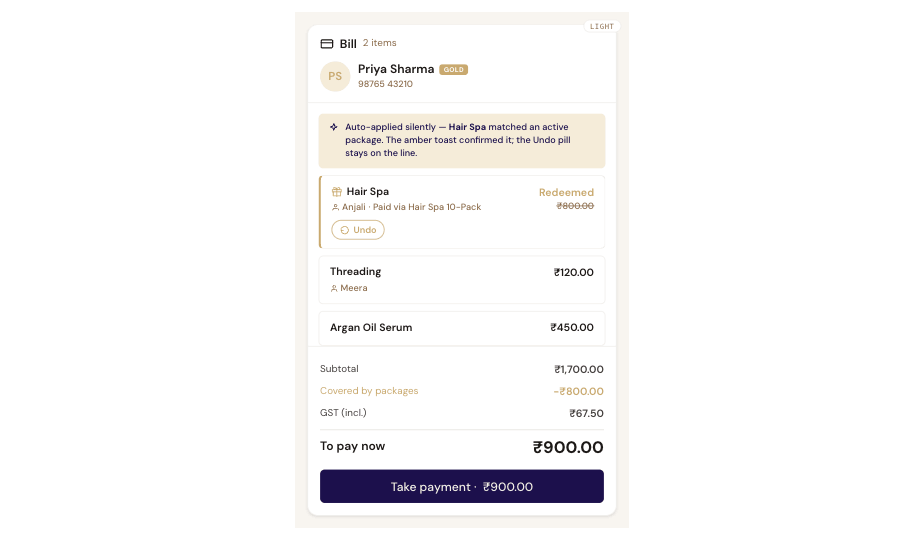 · dark 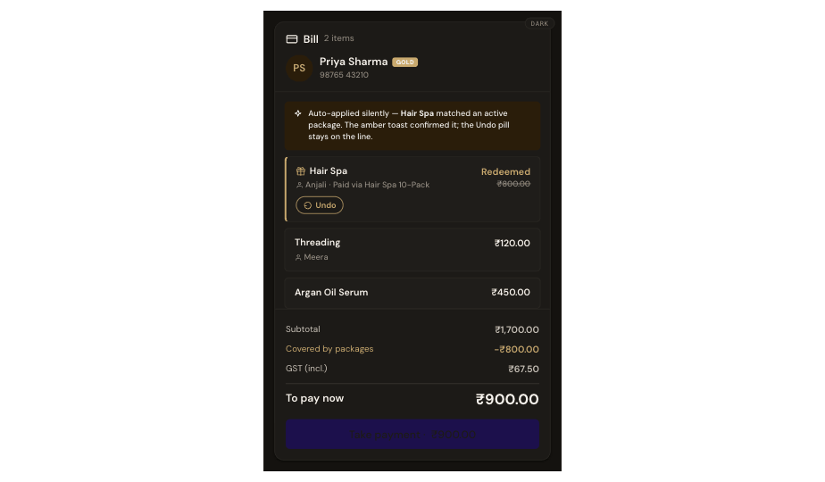
- The matching service auto-applies silently; the line shows **"Redeemed"** in gold with the original price struck through, a gift glyph, and a **persistent `[↩ Undo]` pill** (always visible, *not* hover-gated — the cashier must always be able to tell a redemption happened). An amber toast fires once as affirmative feedback.

### Multiple eligible packages — inline selector (2 variants)

- **A · Inline radio ★** — 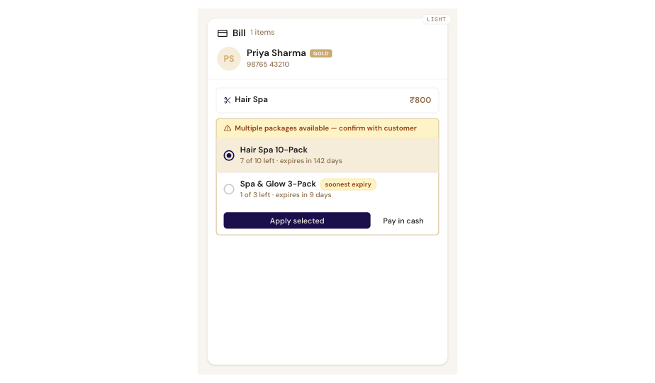 — a `gold`-bordered inline panel with a `warning` header "Multiple packages available — confirm with customer," radio rows pre-selecting **FIFO by soonest expiry** (badged), and Apply / Pay-in-cash actions. Not a modal; clearly invites the confirm-with-customer moment.
- **B · Pick-one cards** — 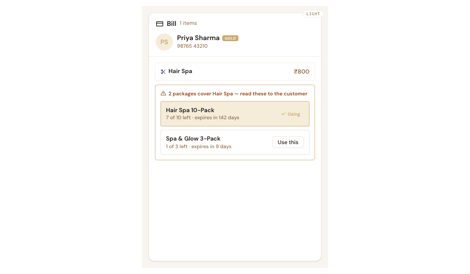 — same content as side-by-side selectable cards with a "Use this" button per option.
- **Recommendation: A.** The radio list reads as a single decision with a clear default; cards imply equivalent peers and take more vertical space in the bill canvas.

### Shared redemption (recipient ≠ buyer)

- **Mockup (Owner/Reception):** 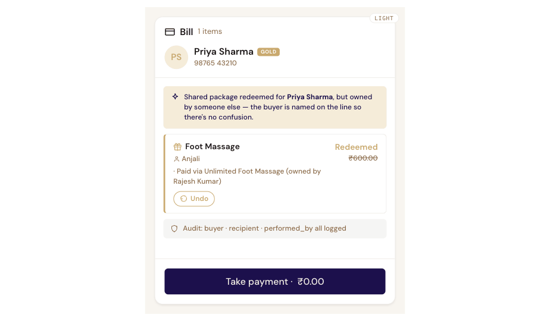 · **Staff (PII-redacted):** 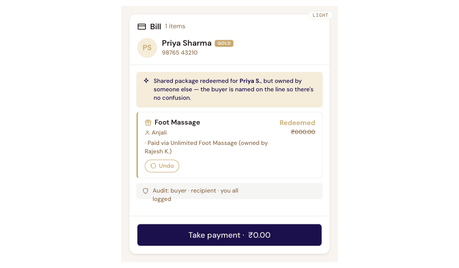
- The buyer's name appears on the line as `Paid via Foot Massage (owned by Rajesh Kumar)` — present enough to prevent confusion, secondary in weight so it doesn't steal from the service. Staff role sees `owned by Rajesh K.` Audit note (buyer · recipient · performed_by) shown as a muted strip.

### Active-packages badge (fallback surface — all states)

- **Mockup (0 / 1 / many / expiring):** 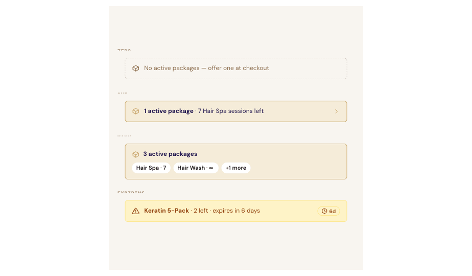
- **0:** dashed muted "offer one at checkout." **1:** gold pill with sessions-left. **Many (4+):** gold pill + an inner chip row with a **`+N more` overflow chip** (no scroll, no carousel — overflow keeps it bounded). **Expiring:** `warning` treatment with days-left badge.
- **Recommended badge format: the inline gold pill with an overflow chip** for the many-case. **Note:** under the recommended Direction-A IA, this badge is largely superseded by the permanent Entitlements Rail — keep it as the surface for layouts/viewports without the rail.
- **Token usage:** `gold-soft` bg + `gold-default` border for active states; `warning-*` for expiring; overflow chip `surface-card`.

---

## Q-VIS-5 · Refund modal (Owner)

**Intent:** Make the customer-facing refund number unambiguous while keeping the (complex, branching) intermediate math transparent. One shell, branching rows.

- **Mockups:** counted 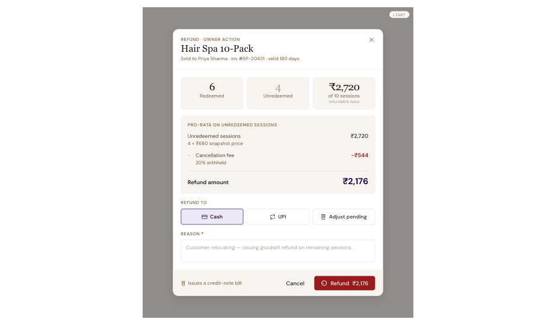 · dark 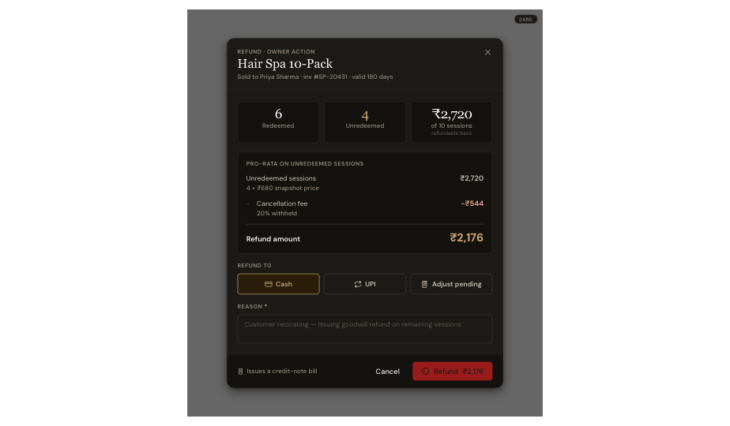 · unlimited 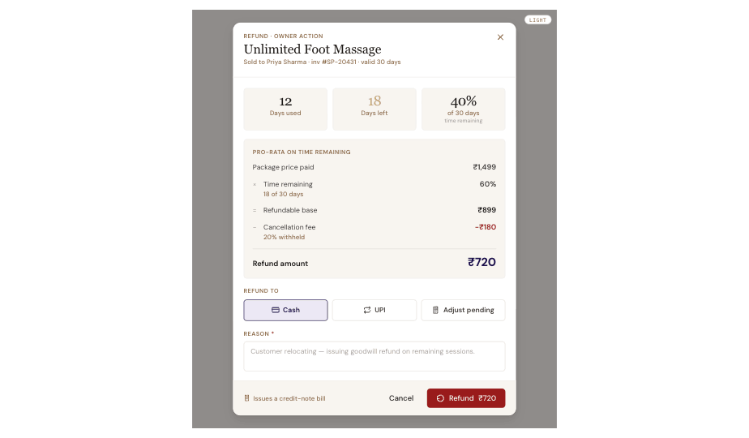 · **expired goodwill** 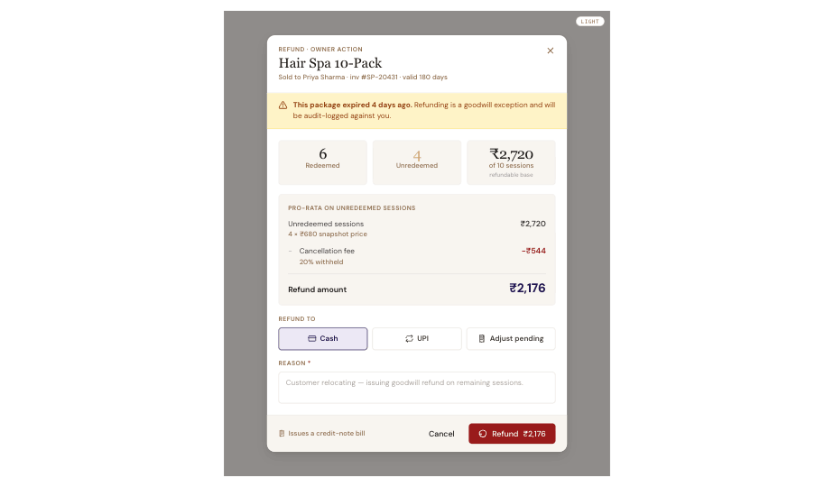
- **Common shell, branching math:** a 3-tile usage summary at top (counted: Redeemed / Unredeemed / refundable base; unlimited: Days used / Days left / % time remaining), then a labeled math block whose **rows differ by entitlement type** but whose shell, refund-to picker, reason field, and footer are identical. The customer-facing **Refund amount** is the only `db-num`-weighted figure and is tinted `accent-default` — visually terminal.
  - **Counted:** `unredeemed sessions × snapshot price − cancellation fee`.
  - **Unlimited:** `price × time-remaining % − cancellation fee`.
- **Refund-to picker** (`Cash / UPI / Adjust pending balance`): a 3-segment selector sitting **between the math and the reason field** — after "how much," before "why."
- **Expired-package goodwill:** a `warning` banner pinned at the **top of the modal body** (below the title, above the math) — it conditions the whole interaction, so it leads rather than hiding inline.
- **Reason** is required (`danger` asterisk); footer notes "Issues a credit-note bill"; primary action is `danger` "Refund ₹X".
- **States:** counted, unlimited, expired-goodwill, role-restricted (entire action is Owner-only — Receptionist/Staff never see the entry point).
- **Token usage:** modal `surface-card` on `surface-overlay`; usage tiles `surface-page`; cancellation-fee + warnings `danger`/`warning`; refund-to selected segment `accent-bg-soft` + `accent-default`.

---

## Q-VIS-4 · Customer profile — Packages tab

**Intent:** Present everything a customer has bought or been gifted, resolving the **buyer-vs-recipient asymmetry** without confusion, with expiry urgency and history.

- **Mockups:** Owner/Reception 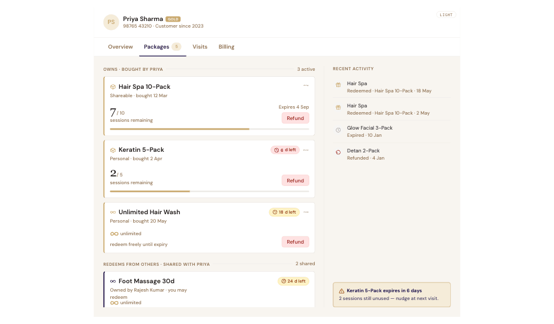 · **Staff (first-name-only)** 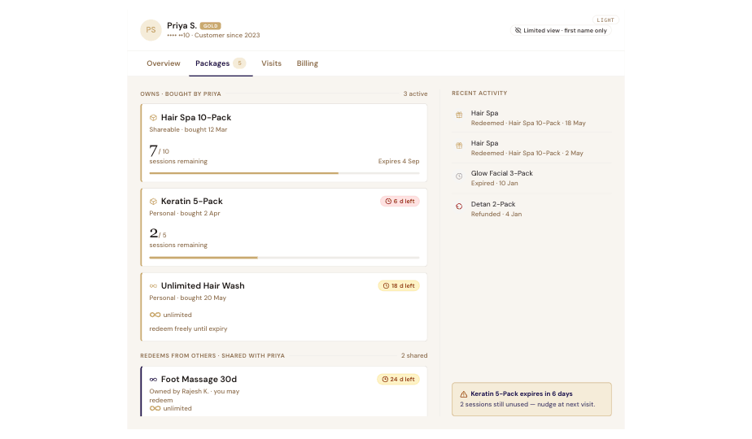 · dark 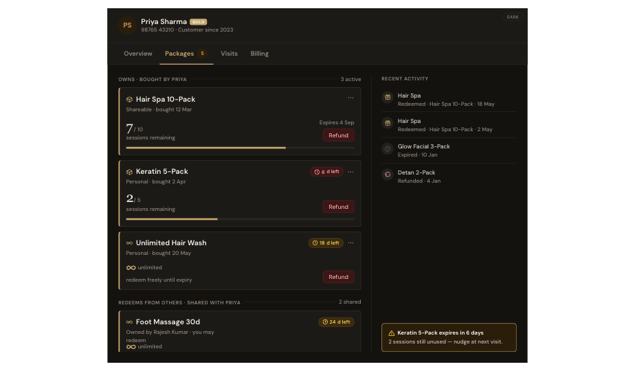
- **Layout: a tab** within the customer profile (not an accordion — packages are a first-class concern worth a durable URL). Left column splits into two clearly-labeled groups: **"Owns · bought by Priya"** (gold left-rail cards) and **"Redeems from others · shared with Priya"** (navy left-rail + gift glyph). The colour + glyph asymmetry is what disambiguates the two roles at a glance. Right rail = recent activity (redeemed / expired / refunded) + an expiring-soon nudge.
- **Per package:** name, `SessionsLeft` (or ∞), expiry with green/amber/red `ExpiryBadge`, shareable/personal, progress bar. **Refund** button is **inline but quiet** (`dangerSoft`, Owner-only) on owned packages — present without shouting; the kebab holds the rarer actions (extend expiry, view audit).
- **Expiring-soon (≤30d):** an `ExpiryBadge` in `warning`/`danger` next to the name *and* a summary nudge card in the right rail.
- **Staff redaction:** buyer names on shared packages render `Rajesh K.`; a "Limited view · first name only" badge sits in the header.
- **Token usage:** owned cards 3px `gold-default` rail; recipient cards 3px `accent-default` rail + gift glyph; progress bars match the rail colour; history glyphs tinted per kind (`gold` / `text-disabled` / `danger`).

---

## Customer profile — Overview tab (host page, designed alongside)

**Intent:** Not in the original §6 list, but the Packages tab needs a host. Today customer detail is a **dialog** (`customer-history-dialog.tsx`), not a tabbed profile — so a real Overview was designed to justify the tab bar. Grounded entirely in the live `Customer` schema (`total_visits`, `total_spent`, `pending_balance`, `last_visit_at`, `date_of_birth`, `gender`, `notes`) + bills history.

- **Mockups:** Owner/Reception 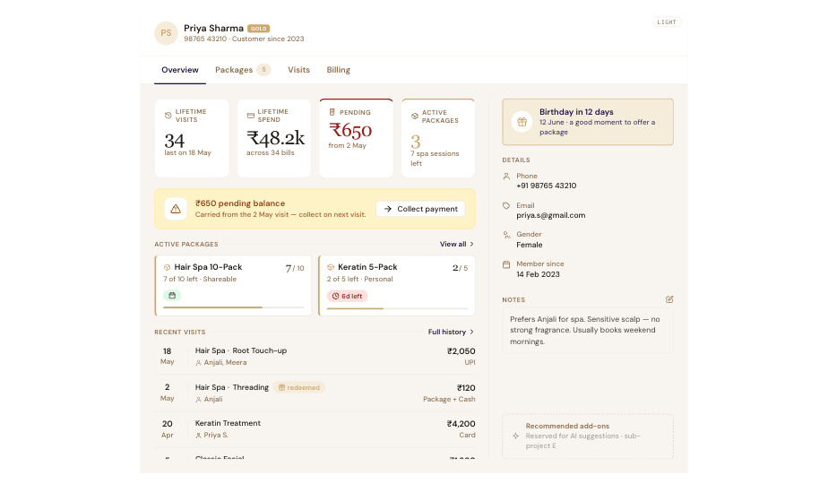 · **Staff (PII-redacted)** 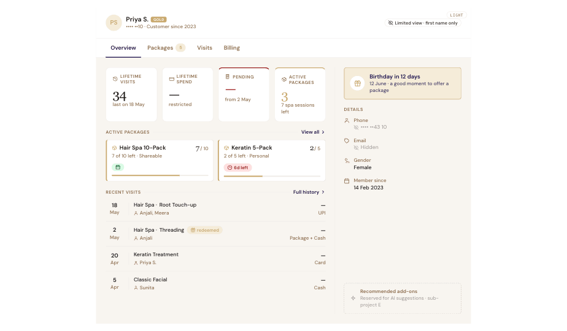 · dark 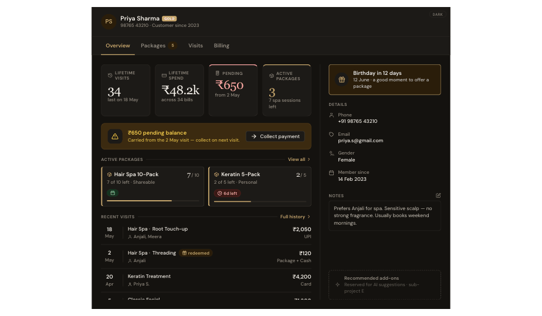
- **Contents:** editorial stat band (Lifetime visits / Lifetime spend / Pending / Active packages); a `pending_balance > 0` action card with a Collect button (wired to the existing pending-payment flow); an active-packages summary deep-linking to the Packages tab; recent visits from the bills shape (date · services · staff · total · payment, with a `redeemed` tag); right rail with a **birthday nudge** (derived from `date_of_birth`'s month/day), personal details, staff notes, and a **marked future slot** for AI "recommended add-ons" (sub-project E). Tier badge slots next to the name (sub-project D).
- **Staff redaction:** lifetime spend + pending show `—` (restricted), phone masked, email/notes hidden, eye-off icons mark every redacted field.
- **Token usage:** stat tiles `surface-card` with a `db-num` numeral, pending tile top-accented `danger-fg`, packages tile top-accented `gold-default`; birthday + nudge cards `gold-soft`; future slot dashed `border-strong`.

---

## Q-VIS-6 · Empty states

**Intent:** First-run and zero-data states that orient rather than dead-end.

- **POS package selector, no published packages:** 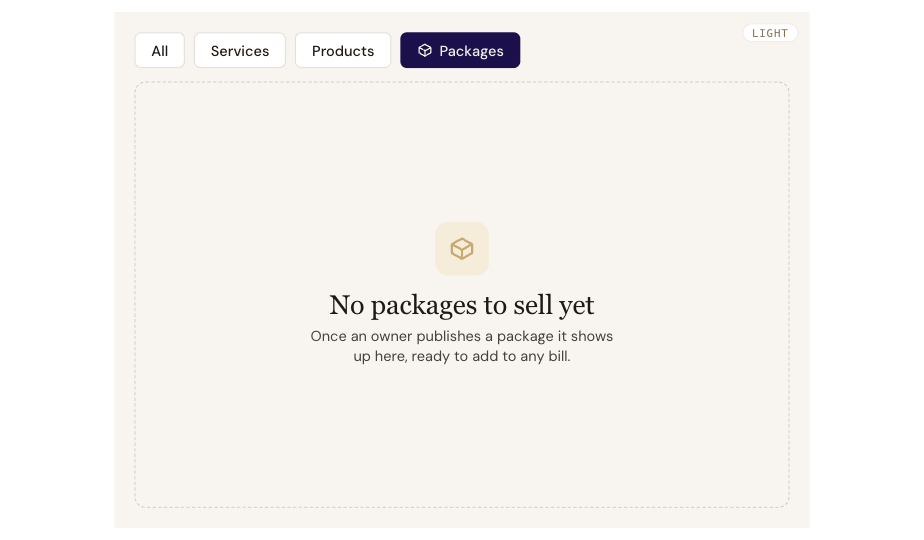 — dashed frame, "No packages to sell yet," points back to the owner publishing flow.
- **Customer with no packages:** 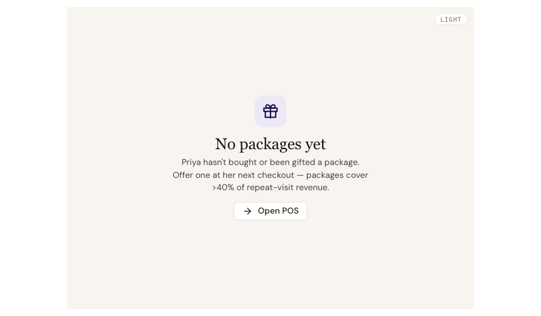 — "No packages yet" + an "Open POS" CTA to offer one.
- **Catalog empty (first-run):** covered in Screen 1 above.
- **First-time-selling guidance:** recommend a *one-time, dismissible* inline coachmark on the new Packages chip (not a blocking walkthrough) — see open-questions for whether to build it this round.
- **Token usage:** empty frames `border-strong` dashed on `surface-page`; serif headlines per the soft constraint; CTAs `secondary`/`ghost`.

---

## Q-VIS-7 · Cross-cutting micro-interactions (rationale)

- **Auto-apply feedback:** a single amber (gold) toast — "Hair Spa redeemed from 10-Pack" — plus the line sliding in with a ~120ms `gold-default` left-rail wipe. No modal. The `[↩ Undo]` pill is **persistent**, never hover-only, so the redemption is never invisible.
- **Discount redistribution:** affected (unlocked) line prices **tween ~120ms** to new values; locked lines hold. A brief `+/−` delta chip may fade beside each changed line.
- **Badge / rail appearance:** the entitlements surface **fades + 4px rises** (~180ms ease-out) the moment a customer resolves. Never loops, never pulses.
- **Motion budget:** everything ≤180ms; all transitions resolve to **0ms under `prefers-reduced-motion`** (the V2 motion tokens already zero out). No looping or decorative animation anywhere.

## Q-VIS-8 · Dark-mode parity (rationale)

- **Accent flips to gold.** On dark, navy disappears against charcoal, so the token set already remaps `accent-default → #c9a96e`. Because packages were *already* gold, **package surfaces read identically gold in both themes** — the ownership colour is theme-stable, which is a happy consequence of the cross-cutting grammar.
- **Expiring gradient.** Urgency on dark uses `warning-bg-soft` (`#3b2a10`) + `warning-fg` (`#fcd34d`) — warm amber on warm charcoal. Reads urgent without the red-on-black vibration; **no aggressive gradient needed.** Verified on the rail, refund, and profile dark mockups.
- **Validity green** uses perceptually-matched `success-*` so green/amber/red still rank correctly at a glance.
- **Contrast:** every pairing clears WCAG AA (4.5:1 body, 3:1 large + non-text). Redemption lines stay full-strength in both themes — never dimmed.
- **Anomalies discovered:** none that break the system. One thing to watch (see open-questions): the white capture letterboxing in these PNGs is a harness artifact, *not* a screen background — dark screens fill their own `surface-page`.

---

## Decision Log (machine-readable summary)

| Concern | Decision | Brief section |
|---|---|---|
| Design-system source of truth | Use **live tokens** (Navy `#1c104c` + Gold `#c9a96e`, Cormorant Garamond + DM Sans, cream `#f8f5f0`) — brief's copper/Instrument palette is stale | §1 |
| POS IA | **Entitlements Rail** — permanent gold rail, peer to bill, appears only with a customer | Q-VIS-9 |
| Cross-cutting colour grammar | Navy = paid-now; Gold = already-owned (packages/redemptions/credit) | §7/§8 |
| Build-form discount toggle UX | **Segmented control** (`% / ₹ off / Final amount`) with morphing input suffix | Q-VIS-1 |
| Locked-line treatment | Gold lock glyph + faint `gold-soft` row tint + lock toggle column; redistribution skips locked lines | Q-VIS-1 |
| MRP-vs-final diff placement | Always-visible small text under each line price | Q-VIS-1 |
| Entitlement × shareability input | **2×2 visual radio-card matrix** | Q-VIS-1 |
| Unlimited form reshape | Qty column collapses; discount defaults to **Final amount** | Q-VIS-1 |
| Package row in selector | **Card with inner service-chip cluster** + gold border + PACKAGE badge | Q-VIS-2 |
| Package_sale_line summary | **Collapsible accordion** "N services included" → chip cluster | Q-VIS-2 |
| Selling-staff picker location | **Inline on the bill line** | Q-VIS-2 |
| Undo pill prominence | **Persistent, always visible** (not hover-gated) | Q-VIS-3 |
| Multi-package selector style | **Inline radio panel**, FIFO-by-expiry default, "confirm with customer" warning header — not a modal | Q-VIS-3 |
| Shared-redemption buyer display | `Paid via X (owned by Buyer)` — secondary weight on the line; `Buyer K.` under Staff redaction | Q-VIS-3 |
| Active-packages badge format | **Inline gold pill + `+N more` overflow chip**; superseded by the rail under Direction A, kept as fallback | Q-VIS-3 |
| Refund modal layout (counted) | Common shell; usage tiles (Redeemed/Unredeemed/base) + `unredeemed × snapshot − fee` rows | Q-VIS-5 |
| Refund modal layout (unlimited) | Same shell; usage tiles (Days used/left/%) + `price × time-remaining − fee` rows | Q-VIS-5 |
| Refund-to picker location | 3-segment selector between the math block and the reason field | Q-VIS-5 |
| Expired goodwill warning | `warning` banner at top of modal body, above the math | Q-VIS-5 |
| Customer profile packages surface | **Dedicated tab**, split into "Owns" (gold rail) vs "Redeems from others" (navy rail + gift) | Q-VIS-4 |
| Profile refund button | Inline, quiet `dangerSoft`, Owner-only; rarer actions in kebab | Q-VIS-4 |
| Customer Overview tab | Designed net-new as host page (today's detail is a dialog) — stat band + pending action + visits + birthday nudge + future AI slot | added |
| PII redaction (Staff) | First-name-only + masked phone + hidden email/spend/notes, eye-off markers, "Limited view" badge | §7 hard-constraint |
| Proposed new primitive | `SessionsLeft` numeral + `ExpiryBadge` pair (reused across rail/profile/refund) | §7 |
| Micro-interaction budget | All motion ≤180ms; `gold` rail-wipe on redeem; price tween on redistribution; 0ms under reduced-motion | Q-VIS-7 |
| Dark-mode anomalies discovered | **None breaking.** Accent→gold remap means packages are theme-stable gold; amber-on-charcoal expiry reads urgent without aggression | Q-VIS-8 |

---

*Mockups are mid/hi-fidelity reference renders captured from the live HTML prototypes; the interactive canvas (`packages-design/Packages Design Exploration.html`) carries every artboard at full fidelity and is the source of record for visual nuance. Capture letterboxing (white margins) is a harness artifact, not a screen background.*
